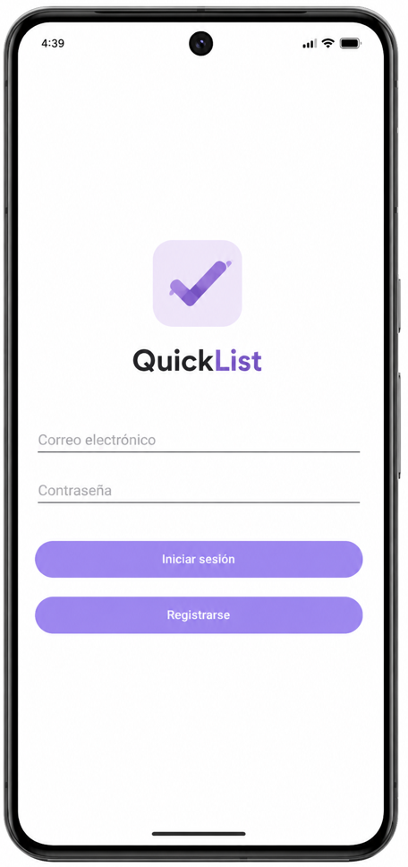
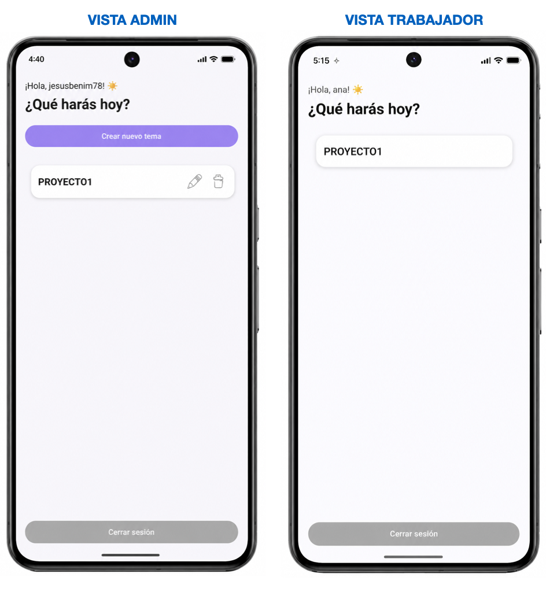
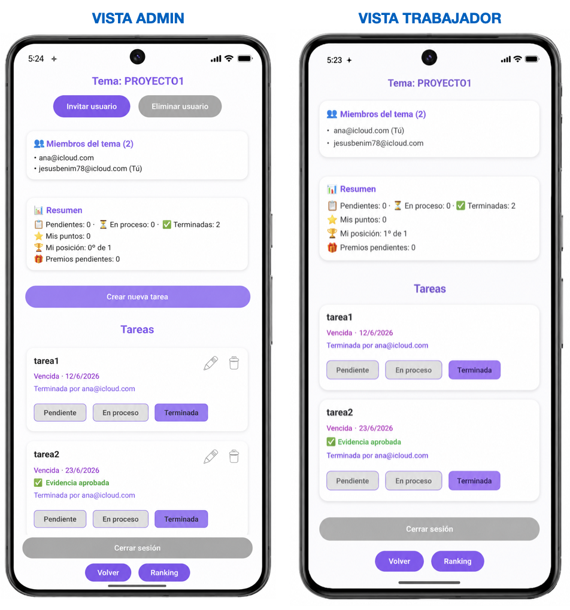
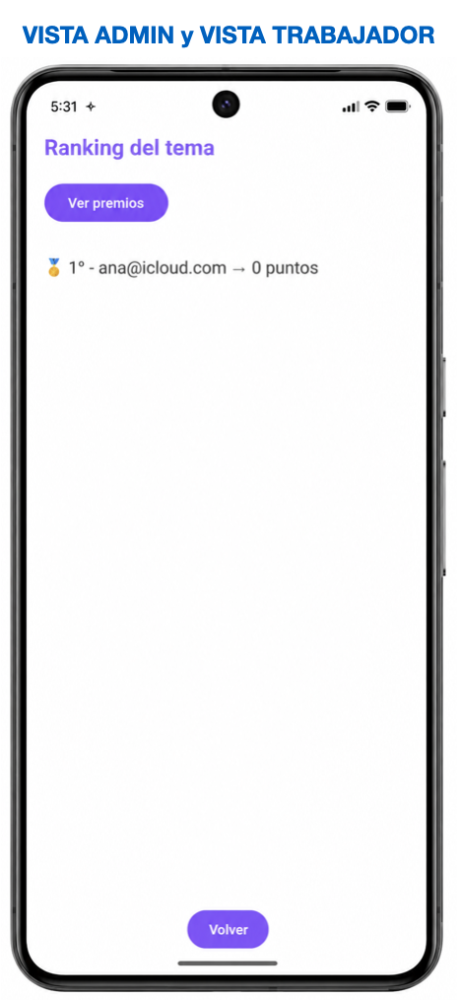
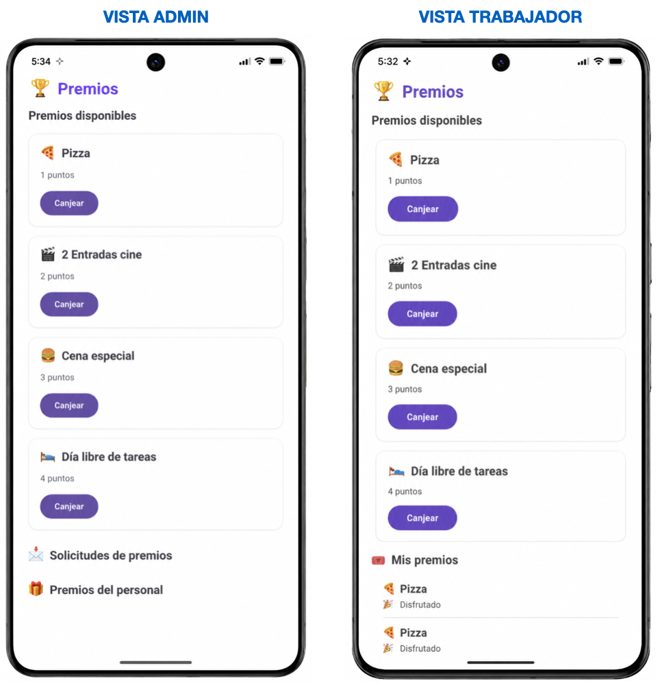

# ProyectoQuickList

Aplicación Android desarrollada con Kotlin y Firebase para la gestión colaborativa de tareas personales y grupales.

## Funcionalidades

- Creación de listas compartidas.
- Asignación de tareas entre usuarios.
- Seguimiento del progreso.
- Gestión de tareas pendientes y completadas.
- Evidencias fotográficas de tareas finalizadas.
- Organización mediante categorías y temas.

## Tecnologías utilizadas

- Kotlin
- Firebase Firestore
- Android Studio
- XML

## Objetivo del proyecto

Proyecto desarrollado como Trabajo Final del ciclo de Desarrollo de Aplicaciones Multiplataforma (DAM), orientado a aplicar conceptos de desarrollo Android, bases de datos en la nube y desarrollo de interfaces móviles.

## Estado del proyecto

🚧 Proyecto académico finalizado y abierto a futuras mejoras y ampliaciones.

## Capturas de pantalla

### Pantalla principal

### Crear tema

### Crear tarea

### Ranking

### Premios

## Aprendizajes
Durante el desarrollo del proyecto aprendí:
- Gestión de datos en Firebase Firestore.
- Navegación entre actividades y fragments.
- Diseño de interfaces Android.
- Gestión del estado de tareas y usuarios.
- Trabajo con imágenes y almacenamiento.
